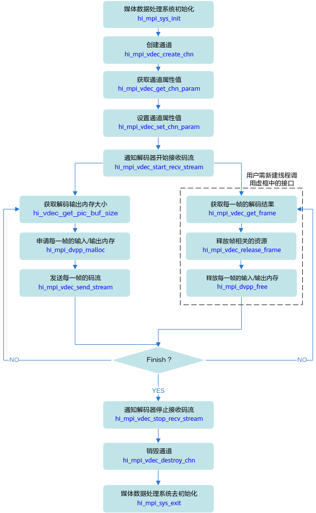

# readme<a name="ZH-CN_TOPIC_0000001072769993"></a>

### 本样例为大家学习昇腾软件栈提供参考，非商业目的！
### 本样例适配5.0.3及以上版本，支持产品为Atlas 推理系列产品（Ascend 310P处理器）、Atlas 200/500 A2推理产品。


## 功能描述<a name="section09679311389"></a>

DVPP中的JPEGD功能模块，实现.jpg、.jpeg、.JPG、.JPEG图片的解码。

## 原理介绍<a name="section19985135703818"></a>

样例中的关键接口调用流程如下：



## 目录结构<a name="section86232112399"></a>

```
├──————CMakeLists.txt        // 编译脚本，调用src目录下的CMakeLists文件
├──————src                   // 示例代码文件所在的目录
```

## 环境要求<a name="section10528164623911"></a>

- 操作系统及架构：Ubuntu 18.04 x86\_64、Ubuntu 18.04 aarch64、EulerOS aarch64

- 编译器：g++ 或 aarch64-linux-gnu-g++

- 芯片：Atlas 推理系列产品（Ascend 310P处理器）、Atlas 200/500 A2推理产品。

- 已完成昇腾AI软件栈在开发环境、运行环境上的部署。

## 准备测试数据<a name="section13765133092318"></a>

请单击如下链接，获取该样例的测试图片数据：

[Img201509290968_H.JPG](https://obs-9be7.obs.cn-east-2.myhuaweicloud.com/data/dvpp_sample_input_data/Img201509290968_H.JPG)

[dvpp_jpegd_decode_1920x1080.jpg](https://obs-9be7.obs.cn-east-2.myhuaweicloud.com/data/dvpp_sample_input_data/dvpp_jpegd_decode_1920x1080.jpg)

[dvpp_jpegd_vpc_jpege.jpg](https://obs-9be7.obs.cn-east-2.myhuaweicloud.com/data/dvpp_sample_input_data/dvpp_jpegd_vpc_jpege.jpg)

## 编译运行<a name="section3789175815018"></a>

1. 以运行用户登录开发环境，编译代码。此时存在以下两种情况：
   1. 当开发环境与运行环境的操作系统架构相同时，例如两者都是X86架构，或者都是AArch64架构，此时编译流程参考如下：
        1. 设置环境变量。

            如下示例，$HOME/Ascend表示编译环境runtime标准形态安装包的安装路径，latest对应安装包版本号，请根据实际情况替换。

            ```
            export DDK_PATH=$HOME/Ascend/latest
            export NPU_HOST_LIB=$DDK_PATH/runtime/lib64/stub/
            ```
        2. 切换到jpegd\_sample目录，依次执行如下命令执行编译。

            ```
            mkdir build
            cd build
            cmake .. -DCMAKE_CXX_COMPILER=g++ -DCMAKE_SKIP_RPATH=TRUE
            make
            ```
            在“jpegd\_sample/build/“目录下会生成可执行程序jpegd\_demo。

   2. 当开发环境与运行环境的操作系统架构不同时，例如开发环境是X86架构、运行环境是AArch64架构，此时涉及交叉编译，需要在开发环境安装包含AArch64工具链的软件包，并将相关环境变量指向AArch64版本路径，具体编译流程参考如下：
        1. 提前在x86_64编译环境安装x86_64版本的CANN-toolkit包
        2. 设置环境变量。

            如下示例，$HOME/Ascend表示编译环境runtime标准形态安装包的安装路径，latest对应安装包版本号，请根据实际情况替换。

            ```
            export DDK_PATH=$HOME/Ascend/latest
            export NPU_HOST_LIB=$DDK_PATH/runtime/lib64/stub/aarch64
            ```
        3. 切换到jpegd\_sample目录，依次执行如下命令执行编译。

            ```
            mkdir build
            cd build
            cmake .. -DCMAKE_CXX_COMPILER=$HOME/Ascend/latest/toolkit/toolchain/hcc/bin/aarch64-target-linux-gnu-g++ -DCMAKE_SKIP_RPATH=TRUE
            make
            ```
            在“jpegd\_sample/build/“目录下会生成可执行程序jpegd\_demo。


2. 以运行用户将开发环境的“jpegd\_sample/build“目录下的可执行程序jpegd\_demo以及[准备测试数据](#section13765133092318)中测试数据上传到运行环境（Host）的同一目录下，例如“$HOME/dvpp/jpegd\_sample“。

3. 以运行用户登录运行环境（Host），运行应用。

   1. 切换到可执行程序所在的目录，例如“$HOME/dvpp/jpegd\_sample“，给该目录下的jpegd\_demo文件加执行权限。

      ```
      chmod +x jpegd_demo
      ```

   2. 设置环境变量：“/usr/local/Ascend“为runtime组件的默认安装路径，请根据实际情况替换。

      ```
      export LD_LIBRARY_PATH=/usr/local/Ascend/runtime/lib64
      ```

   3. <a name="li163081446763"></a>运行应用。

      运行可执行文件的命令示例及说明请参见[JPEGD基础功能](#section16675547162815)、[JPEGD性能测试](#section17726337299)。

      运行可执行文件的参数说明如下所示：

      - img\_width：输入图片的宽度。
      - img\_height：输入图片的高度。
      - pixel\_mode：JPEG图像解码后的格式，所有像素格式的JPEG图片只能在YVU原格式SP、YUV原格式SP与YUV420SP、YVU420SP之间四选一，400是YUV400与YUV420SP、YVU420SP三选一。假如用户不知道该图片的像素格式，可选UNKNOWN由DVPP自行解析。
        - 0：YUV400
        - 1：YUV420SP
        - 2：YVU420SP
        - 3：YUV422SP
        - 4：YVU422SP
        - 5：YUV444SP
        - 6：YVU444SP
        - 1000：YUV440SP
        - 1001：YVU440SP
        - 10000：UNKNOWN
      - chn\_num：创建解码通道的数目。默认参数为1。
      - start\_chn：创建解码通道的起始通道号。默认参数为0。
      - in\_image\_file：输入图像文件的路径，包含文件名。
      - write\_file：保存解码文件开关。
        - 0：关闭
        - 1：默认参数，开启
      - out\_image\_file：输出图像文件的路径，包含文件名。当"write\_file"关闭时，该配置无效。
      - send\_circle：输入图像发送给JPEGD解码器的次数。
        - -1：  循环发送，直至断电或Ctrl + C强行退出
        - 0：  默认参数，发送一次
        - 大于0： 按输入参数发送若干次
      - performance\_mode：性能测试开关。开启性能测试开关之后，"write\_file"保存解码文件功能将自动关闭。
        - 0：默认参数，关闭
        - 1：开启
      - delay\_time：发送前的等待时间，所有通道等待输入所定的秒之后，一齐发送码流。该参数用于性能测试时减小通道之间因为启动时间不同步引起的性能参数差异，非性能模式下无效。
      - wait\_time：最大等待时间，以秒为单位。超出设定时间后进入退出流程。
      - whole_dir：兼容性测试的输入文件夹路径。设置后将交给JPEGD解码该文件夹下所有以.jpg或.JPEG为后缀的文件，不设置则不会触发该模式。


## JPEGD基础功能<a name="section16675547162815"></a>

运行示例：

```
./jpegd_demo --in_image_file dvpp_jpegd_decode_1920x1080.jpg --pixel_mode 2 --chn_num 2 --start_chn 16 --send_circle 100 
```

-   示例描述：从通道号16开始使用2个通道的JPEGD解码器将dvpp\_jpegd\_decode\_1920x1080.jpg解码为宽高1920x1080的YVU420文件，解码100次。
-   输入图像：宽1920像素、高1080像素、名称为“dvpp\_jpegd\_decode\_1920x1080.jpg”的JPEG图片。
-   输出图像：宽1920像素、高1080像素的YVU420SP格式图片。
-   Host端与Device端配置参数相同。

## JPEGD性能测试<a name="section17726337299"></a>

运行示例：

```
./jpegd_demo --performance_mode 1 --in_image_file dvpp_jpegd_decode_1920x1080.jpg --img_width 1920 --img_height 1080 --pixel_mode 2 --chn_num 18 --send_circle 1000 --delay_time 20
```

-   示例描述：以性能模式测试18个通道的JPEGD解码器，将dvpp\_jpegd\_decode\_1920x1080.jpg解码为宽高1920x1080的YVU420文件1000次，获取性能数据。
-   输入图像：宽1920像素、高1080像素、名称为“dvpp\_jpegd\_decode\_1920x1080.jpg”的JPEG图片。
-   输出图像：无。性能模式下文件不会被保存，待jpegd_demo运行结束后会将18个通道的解码性能数据打印出来。
-   Host端与Device端配置参数相同。

## JPEGD兼容性测试<a name="section17726337299"></a>

运行示例：

```
./jpegd_demo --whole_dir ./ImageNetRaw/ --write_file 1 --chn_num 16 --send_circle 100
```

-   示例描述：以兼容性测试模式，将--whole_dir所指定路径下所有以.jpg和.JPEG为后缀的文件交给JPEGD进行解码。该方法主要用于测试JPEGD对指定文件夹内所有图片的解码兼容性。
-   输入图像：参数--whole_dir指定文件夹内的所有.jpg和.JPEG为后缀的文件，./ImageNetRaw/只是示例，用户可自行决定测试图片的存放位置。
-   输出图像：当参数--write_file为1时，输出图像为当前jpegd_demo所在文件夹中、由JPEGD按原格式解码出的YUV图像。当--write_file为0时不会输出YUV图像。
-   Host端与Device端配置参数相同。
